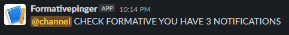

# formative-notifications

This script checks every 10 minutes for the amount of notifications you have on <https://www.formative.com/>

It currently only works with slack webhooks, please make sure you input a url starting with `https://hooks.slack.com/services/`

Example of the output:

Setup:

1. Install all of the dependencies
2. Enter your info in the formativesettings.json
3. Run the script!
